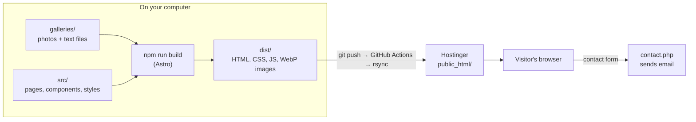
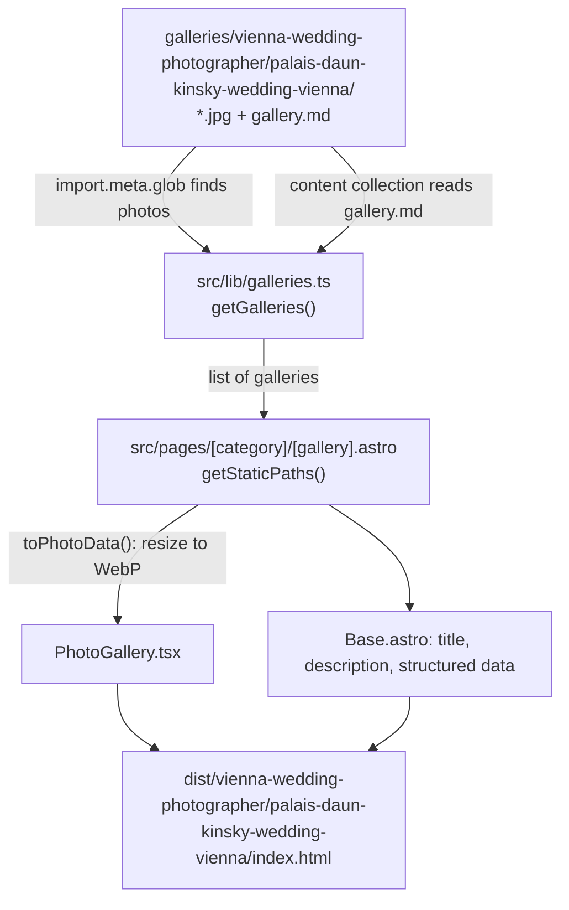
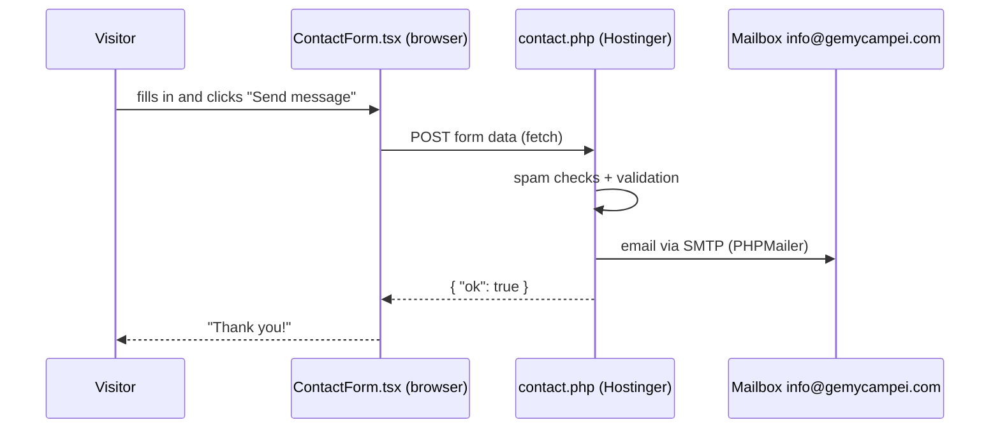

# gemycampei.com

The website of **Gemy Campei**, wedding and elopement photographer in Vienna and the Dolomites.

This README is a guided tour through the project: what each tool does, how the pieces fit
together, where to find things, and how to add content. Every code file also has a comment
block at the top explaining what it does.

- Deployment to Hostinger: [docs/DEPLOYMENT.md](docs/DEPLOYMENT.md)
- Search engine optimisation: [docs/SEO.md](docs/SEO.md)
- Adding photos: [galleries/README.md](galleries/README.md)
- Managing galleries, texts, packages, journal, reviews and settings with a click-and-drag app: `npm run manage` ([section 7](#7-the-gallery-manager))

---

## Contents

1. [Quick start](#1-quick-start)
2. [The big picture](#2-the-big-picture)
3. [Tech stack](#3-tech-stack)
4. [Project structure](#4-project-structure)
5. [How a page is made](#5-how-a-page-is-made)
6. [Adding and editing content](#6-adding-and-editing-content)
7. [The gallery manager](#7-the-gallery-manager)
8. [React in this project](#8-react-in-this-project)
9. [Fast image loading](#9-fast-image-loading)
10. [Styling](#10-styling)
11. [The contact form](#11-the-contact-form)
12. [Common tasks and problems](#12-common-tasks-and-problems)
13. [Glossary](#13-glossary)

---

## 1. Quick start

You need [Node.js](https://nodejs.org) 22.12 or newer.

```bash
npm install          # once: downloads all libraries into node_modules/
npm run manage       # opens the gallery manager in your browser (see section 7)
npm run import-pixieset  # downloads the gallery photos from the old Pixieset site (galleries/README.md)
npm run dev          # starts a local preview at http://localhost:4321
npm run build        # creates the finished website in dist/
npm run preview      # shows the finished dist/ website locally
npm run check        # checks all TypeScript and Astro files for errors
```

`npm run dev` updates the browser automatically whenever you save a file. Drafts (galleries
with `draft: true`) are only visible there, never on the live site.

The first `npm run build` optimises every photo and takes a minute or two. Later builds reuse
the results and take seconds.

---

## 2. The big picture

The site is a **static website**: every page is a finished HTML file, created once on your
computer (or on GitHub) and then simply served by Hostinger. There is **no database** and no
server program generating pages while visitors browse. That makes the site fast, cheap,
secure and easy to back up (it is just files).



**Build time** (before upload): Astro reads the photo folders and text files, resizes photos,
turns components into HTML and writes everything into `dist/`.

**Browser time** (when someone visits): the browser receives ready HTML. Only a few small
interactive parts run JavaScript: the photo grid, slider and carousel with their fullscreen
viewer, the gallery filter and the contact form.

---

## 3. Tech stack

| Tool | What it is | Why it is used here |
|---|---|---|
| **[Astro](https://docs.astro.build)** | A website builder ("static site generator") | Turns pages and components into plain HTML files. Ships no JavaScript unless a component needs it, so pages load fast. Has built-in image optimisation. |
| **[React](https://react.dev)** | A library for interactive user interfaces | Used for the parts that react to clicks: lightbox, filter, contact form. Astro loads React only on pages that need it ("islands"). |
| **TypeScript** | JavaScript with types | The editor warns you about mistakes (wrong property names, missing values) before the site breaks. Files end in `.ts` / `.tsx`. |
| **[Vite](https://vite.dev)** | The engine under Astro | Runs the dev server and bundles files. Its `import.meta.glob` feature finds all photos in the gallery folders. The gallery manager uses it directly to serve its React app. |
| **[sharp](https://sharp.pixelplumbing.com)** | Image processing library | Used by Astro to resize photos and convert them to WebP. Also used by `scripts/new-gallery.mjs` and the gallery manager (optimising uploads, thumbnails). |
| **[yaml](https://eemeli.org/yaml/)** | YAML reader/writer | The gallery manager edits the settings blocks of Markdown files with it and keeps your comments intact. |
| **[Zod](https://zod.dev)** | Data validation | Checks every Markdown settings block against `src/content.config.ts`. A typo stops the build with a clear message. |
| **Markdown** (`.md`) | Simple text format | All editable texts: categories, galleries, packages, testimonials. The part between `---` lines holds settings, the rest is text. |
| **[PhotoSwipe](https://photoswipe.com)** | Lightbox library | Fullscreen photo viewer with swipe and keyboard support. |
| **[Fontsource](https://fontsource.org)** | Fonts as npm packages | Newsreader (headings) and Jost (text) are served from our own server instead of Google Fonts (GDPR). Both are variable fonts: one file covers every weight. |
| **PHP + [PHPMailer](https://github.com/PHPMailer/PHPMailer)** | Server-side script + mail library | The only code that runs on the server: sends contact form emails. |
| **`.htaccess`** | Web server configuration | HTTPS, redirects from old Pixieset URLs, caching, security headers. |
| **[GitHub Actions](https://docs.github.com/actions)** | Automation on GitHub | Tests every feature branch, and builds and uploads the site to Hostinger on every change on `master`. |
| **Hostinger** | Web hosting | Serves the files in `public_html/` and runs `contact.php`. |

---

## 4. Project structure

```
website-gemycampei/
│
├── galleries/                         ← ALL GALLERY PHOTOS (see galleries/README.md)
│   ├── vienna-wedding-photographer/                        a category folder = one section of the site (/vienna-wedding-photographer/)
│   │   ├── _category.md                   settings, intro text + order of the galleries
│   │   ├── hero.jpg                       big image at the top of the category page
│   │   └── palais-daun-kinsky-wedding-vienna/   a gallery folder = one gallery page
│   │       ├── gallery.md                   optional settings + story text (+ Vimeo videos)
│   │       ├── posters/                     optional: preview images of the videos
│   │       └── *.jpg                        the photos, sorted by file name
│   ├── dolomites-elopement-photographer/  vienna-maternity-photographer/  35mm-film-super-8-wedding/
│
├── src/                               ← THE WEBSITE CODE
│   ├── pages/                           every file here becomes a URL (see section 5)
│   │   │                                  the English pages are thin wrappers around src/views/
│   │   ├── index.astro                    /
│   │   ├── about.astro                    /about/
│   │   ├── contact.astro                  /contact/
│   │   ├── testimonials.astro             /testimonials/
│   │   ├── wedding-photography-packages.astro   /wedding-photography-packages/
│   │   ├── dolomites-elopement-packages.astro   /dolomites-elopement-packages/
│   │   ├── galleries/index.astro          /galleries/  (overview with filter)
│   │   ├── [category]/index.astro         /vienna-wedding-photographer/, /dolomites-elopement-photographer/ ...  (one per category folder)
│   │   ├── [category]/[gallery].astro     /vienna-wedding-photographer/palais-daun-kinsky-wedding-vienna/ ...
│   │   ├── journal/index.astro, journal/[slug].astro   /journal/ … (guides)
│   │   ├── redirects.json.ts              list of old Pixieset URLs → new URLs
│   │   ├── imprint.astro, privacy.astro   legal pages
│   │   └── 404.astro, thank-you.astro, message-error.astro
│   │
│   ├── components/                      reusable building blocks
│   │   ├── Header.astro, Footer.astro     menu and footer on every page
│   │   ├── CallToAction.astro             closing "Enquire about your date" band
│   │   ├── VimeoVideo.astro               Super 8 video, loads Vimeo only after a click
│   │   ├── PackagesPage.astro             layout of both packages pages
│   │   ├── Faq.astro                      questions & answers
│   │   ├── SchemaOrg.astro                structured data for Google
│   │   ├── GalleryCard.tsx (+ .css)       React: one gallery preview card
│   │   ├── GalleryFilter.tsx (+ .css)     React: filter buttons on /galleries/
│   │   ├── PhotoGallery.tsx (+ .css)      React: photo grid on gallery pages
│   │   ├── PhotoSlider.tsx (+ .css)       React: one-at-a-time slider with thumbnails (optional display)
│   │   ├── PhotoCarousel.tsx (+ .css)     React: full-width moving row of photos (gallery pages, carousel display)
│   │   ├── useLightbox.ts                 React hook: fullscreen viewer shared by the three above
│   │   ├── carousel.ts                    scroll helpers for slider and carousel
│   │   └── ContactForm.tsx (+ .css)       React: the inquiry form
│   │
│   ├── routes/de/                       the German pages (/de/, /de/hochzeitsfotograf-wien/ …). Not in
│   │                                      src/pages/: astro.config.mjs adds them only while the German
│   │                                      version is switched on (settings.yaml → german)
│   │
│   ├── views/                           the page bodies, shared by English and German
│   │                                      (HomeView, CategoryView, GalleryView, ArticleView …)
│   ├── i18n/index.ts                    languages: German menu/button texts, page addresses
│   ├── layouts/Base.astro               HTML frame: <head>, SEO tags, hreflang, header, footer
│   │
│   ├── lib/                             helper functions (no HTML)
│   │   ├── galleries.ts                   reads the galleries/ folders, prepares images
│   │   ├── testimonials.ts                reviews + their links to galleries
│   │   ├── seo.ts                         page titles and structured data (business, person, articles …)
│   │   ├── packages.ts, journal.ts        packages pages and journal articles in both languages
│   │   ├── pages.ts                       reads the texts of the home, about and contact pages
│   │   └── markdown.ts                    **bold** / *italic* for short texts
│   │
│   ├── content/                         texts that are not galleries
│   │   ├── settings.yaml                  email, social links, Google defaults, legal details,
│   │   │                                  German version on/off
│   │   ├── pages/home.yaml, about.yaml, contact.yaml   texts of these pages (en + de)
│   │   ├── packages/<page>/index.md       packages + FAQ of each packages page (+ index.de.md)
│   │   ├── journal/<article>/index.md     guides (+ index.de.md for the German version)
│   │   └── testimonials/*.md              one file per review
│   │
│   ├── assets/                          images used by pages
│   │   ├── home/grid-1/, home/grid-2/     the two photo grids on the home page
│   │   └── about/                         portrait on the about page
│   │
│   ├── styles/global.css                colours, fonts and shared styles
│   ├── content.config.ts                which fields each Markdown file may have
│   └── site.config.ts                   reads src/content/settings.yaml for the rest of the code
│
├── public/                            ← copied unchanged into the website root
│   ├── .htaccess                        server settings + redirects
│   ├── contact.php                      sends contact form emails
│   ├── _mail/PHPMailer/                 mail library for contact.php
│   ├── favicon.svg, robots.txt
│
├── tools/gallery-manager/             ← the local app behind `npm run manage` (section 7)
│   ├── server.mjs                       starts the local web server + opens the browser
│   ├── api/                             Node code that changes files (galleries, photos, documents, trash …)
│   └── app/                             React user interface (components/, schemas.ts, styles.css)
│
├── scripts/new-gallery.mjs            ← helper: create a gallery from a photo export
├── scripts/import-pixieset.mjs        ← helper: download gallery photos from the old Pixieset site
├── scripts/lib/photos.mjs             ← photo optimising shared by the script and the manager
├── .trash/                            ← items deleted in the manager (not in Git, restorable)
├── server/contact-config.example.php  ← template for the mail password file on the server
├── integrations/sitemap.mjs           ← builds the sitemap (both languages, photos) from the finished pages
├── docs/                              ← DEPLOYMENT.md, SEO.md (what the site does for Google + your checklist)
├── .github/workflows/deploy.yml       ← automatic deployment
├── astro.config.mjs                   ← Astro settings (+ redirect writer)
├── package.json                       ← list of libraries and npm scripts
└── tsconfig.json                      ← TypeScript settings
```

Folders you never edit: `node_modules/` (downloaded libraries), `dist/` (build output),
`.astro/` (generated types). They are ignored by Git.

---

## 5. How a page is made

### Routing: file name = URL

Astro looks at `src/pages/`. Each file becomes a page:

| File | URL |
|---|---|
| `src/pages/about.astro` | `/about/` |
| `src/pages/galleries/index.astro` | `/galleries/` |
| `src/pages/[category]/index.astro` | `/vienna-wedding-photographer/`, `/dolomites-elopement-photographer/`, … |

Square brackets mark a **dynamic route**: one file that produces many pages. It exports a
function `getStaticPaths()` that returns a list of pages to build. For categories, that list
comes from the folders in `galleries/`.

### Anatomy of an `.astro` file

```astro
---
// 1. FRONTMATTER: runs at build time (like a script). Import things, load data.
import Base from '../layouts/Base.astro';
const galleries = await getGalleries('vienna-wedding-photographer');
---

<!-- 2. TEMPLATE: HTML with {expressions} -->
<Base title="Weddings">
  <h1>Weddings</h1>
  {galleries.map((g) => <a href={g.href}>{g.title}</a>)}
</Base>

<style>
  /* 3. STYLES: only affect this file */
  h1 { color: var(--accent); }
</style>
```

### From folder to finished gallery page



---

## 6. Adding and editing content

| I want to … | Do this |
|---|---|
| **Add a gallery** | Easiest: `npm run manage` → **+ New gallery**, then drop the photos in. By hand: create a folder in a category folder and copy photos into it. Details: [galleries/README.md](galleries/README.md). Or `npm run new-gallery` (optimises photos). |
| **Change a gallery's title image** | Manager: click the ★ on a photo and the focus point on the cover. By hand: `cover: file-name.jpg` (and optionally `coverFocus: "50% 30%"`) in its `gallery.md`, or name a photo `cover.jpg`. |
| **Hide a gallery** | Manager: tick "Draft". By hand: `draft: true` in its `gallery.md`. |
| **Move a gallery to another category** | Manager: choose another main category and save (folder, photo names, links and redirect are handled). By hand: move the folder and add its previous URL to `legacyUrls`. |
| **Show a gallery in several categories** | Manager: tick the categories. By hand: `alsoIn: [35mm-film-super-8-wedding]` in its `gallery.md`. It keeps one address (its folder) and appears as a card in the other categories too. |
| **Change the order of galleries** | Manager: tab **Order on pages**. By hand: the `galleryOrder` list in each `_category.md`. Every category has its own order. |
| **Set the kind of shoot** | `type: "Couple Session"` in `gallery.md` (default: `singular` of the category). Used in headings and for Google. |
| **Add a category** | Create `galleries/<name>/` with `_category.md` (copy one) and `hero.jpg`. Choose `display: cards`, `slider` or `carousel`. It appears in the menu once it has a visible gallery. |
| **Edit a category page** (intro, steps, FAQ, Google texts, title photo) | Manager: tab **Categories**. By hand: `galleries/<category>/_category.md`. |
| **Edit packages or FAQs** | Manager: tab **Packages** (texts, included lists, photos, FAQ). By hand: `src/content/packages/<page>/index.md`. No prices on the site. |
| **Write a journal article** | Manager: tab **Journal** → type a title → **+ New** → pick a cover photo. It starts as a draft; switch it to "Published" when it's ready. By hand: copy a folder in `src/content/journal/`. |
| **Add videos to a gallery** | Manager: the **Videos** card of the gallery (Vimeo address, title, preview image). By hand: `videos:` in its `gallery.md`, preview images in its `posters/` folder. Allow embedding on gemycampei.com in Vimeo. |
| **Add a testimonial** | Manager: tab **Testimonials**. By hand: copy `src/content/testimonials/annie-and-huong.md`. Link it to a gallery with `gallery:` + `galleryPhoto:` to show it on that gallery page too. |
| **Change home page photos** | Add, remove or rename files in `src/assets/home/grid-1/` and `grid-2/`. |
| **Edit About, Contact, home texts** | Manager: tab **Pages**. By hand: `src/content/pages/home.yaml`, `about.yaml`, `contact.yaml`. The layout and photos are in `src/views/`. |
| **Change email, social links, imprint details** | Manager: tab **Settings**. By hand: `src/content/settings.yaml`. |
| **Switch the German version on or off** | Manager: tab **Settings** → German version (or `german:` in `src/content/settings.yaml`), then restart `npm run dev`. Off: only English is built, no language switch, no hreflang; the German texts stay in their files. |
| **Change colours or fonts** | `src/styles/global.css` (top section) |

Every field allowed in the Markdown settings is listed and explained in
[src/content.config.ts](src/content.config.ts).

### Publishing a change

Work on a feature branch; merging it into `master` publishes the website.

```bash
git switch master && git pull
git switch -c add-lago-di-braies     # a feature branch
npm run dev                          # check it locally (or the Preview button in the manager)
git add .
git commit -m "Add gallery Lago di Braies"
git push -u origin add-lago-di-braies   # GitHub tests the branch, nothing is published
```

Then open a pull request on GitHub and merge it into `master`: GitHub checks, builds and
uploads the site to Hostinger within a few minutes. Setup and details:
[docs/DEPLOYMENT.md](docs/DEPLOYMENT.md).

---

## 7. The gallery manager

```bash
npm run manage
```

This opens a small app in your browser (`http://127.0.0.1:4400`). It is a comfortable way to
change everything you maintain: the files in `galleries/` and `src/content/`. It **only changes
files on your computer**: nothing goes online until you commit and push. Stop it with Ctrl+C in
the terminal.

### The tabs

| Tab | What you can do |
|---|---|
| **Galleries** | Sidebar with every gallery (filter: all / published / drafts). **+ New gallery** asks for main category, title, type, couple and place and suggests the address. The editor has all fields: title, couple, type, location, date, draft, story, SEO title and description (with length counters), address and old addresses. |
| | **Categories**: tick every category the gallery fits, choose the *main* one (it decides the address). A card linking to the gallery then appears on every ticked category page. |
| | **Photos**: drop files onto the grid (or "Add photos"). Each upload is rotated, resized to 2400 px, stripped of camera/GPS data and named `<slug>-001.jpg`; exact duplicates are skipped and small photos get a warning. Drag photos to reorder. Click to select, Shift+click for a range, then turn (↺ Left / ↻ Right), move or delete several at once. ★ makes a photo the cover. |
| | **Cover focus**: click the important spot on the cover. The preview shows how the portrait (3 : 4) card crop will look. |
| | **Checks**: hints such as "fewer than 10 photos", "story is empty", "SEO title too long". |
| | **Videos** (shown for galleries with videos or without photos, e.g. Super 8): Vimeo address, title and preview image per video; upload preview images into the gallery's `posters/` folder. |
| **Categories** | The category pages: menu name, big title, title photo, H1, intro, Google texts, "how it works" steps, FAQ, display style, gallery pages, heading above the videos. |
| **Packages** | The packages pages: heading, intro, every package with its photo and "included" list, FAQ, button text. |
| **Journal** | Guides and stories: **+ New** creates a draft. Title, summary, the text (Markdown), cover and photo row (picked from the galleries, with their descriptions), related galleries, FAQ, dates, published/draft. **Delete** moves the article to the trash. |
| **Testimonials** | Add, edit, delete and drag reviews into order. Link a review to a gallery: the testimonials page then shows "View their gallery" and the gallery page shows the review. The photo can be picked from that gallery or uploaded. |
| **Pages** | The texts of the home, about and contact pages. |
| **Settings** | German version on/off, email, social links, default Google texts, the data for Google (languages, places, services) and the legal details for the imprint. |
| **Order on pages** | Pick a category and drag its galleries into place. Saved immediately. |
| **Trash** | Everything deleted in the manager. Restore or delete for good. |
| **Changes** | Files changed since the last Git commit, grouped per gallery/review, plus the commands to publish them. |

### What is saved when

- **Text and settings** (fields, categories, cover, focus, videos, testimonials, everything in
  the Categories, Packages, Journal, Pages and Settings tabs): with **Save** or Ctrl+S. The
  manager warns you before you leave a form with unsaved changes. Only the fields you changed
  are written; comments and the layout of the files stay as they are.
- **German fields** only appear while the German version is switched on (a **Deutsch** button
  above the form, the Deutsch card of a gallery).
- **Photos and order** (upload, reorder, move, delete, category order, replacing a package or
  title photo, video preview images): immediately.
- **Deleting** moves things into `.trash/` in the project folder. The message that appears
  has an **Undo** button; older deletions are in the Trash tab. `.trash/` is not uploaded.

### Things it takes care of

- **Renaming or moving a gallery** (new slug or main category) moves the folder, renames the
  photos, adds the old address to `legacyUrls` (so a 301 redirect is created) and updates the
  category orders and testimonial links.
- **Reordering photos** renames the files (`-001`, `-002` …) because the website sorts photos by
  file name. Cover and review photos follow along.
- A photo used by a review can't be deleted until the review uses another photo.
- Deleting a gallery that a review links to copies the review photo into the review, so the
  testimonials page keeps working. Restoring the gallery links it again.

### Preview

**Preview** starts `astro dev` in the background (first time about 15 seconds) and opens the
gallery page as it will look on the website, including drafts. The dev server keeps running
after you close the manager; stop it with `npx astro dev stop`.

### How it is built

`tools/gallery-manager/server.mjs` starts a Node web server that only listens on your own
computer. It serves the React app from `app/` through Vite and answers requests under `/api/`
with the code in `api/` (one file per topic: `galleries.mjs`, `photos.mjs`, `testimonials.mjs`,
`trash.mjs` …). The Categories, Packages, Journal, Pages and Settings tabs share one editor:
`api/documents.mjs` reads and writes those files, `app/schemas.ts` lists their fields and
`app/components/DocumentEditor.tsx` builds the forms from that list. A new field on the website
usually needs one more line in `app/schemas.ts`. Every request needs a secret token that is created at start and written into the
page, so other websites open in your browser can't change your files. It's a good project for
learning React: the components in `app/components/` use state, effects, custom hooks
(`app/hooks.ts`) and drag & drop.

---

## 8. React in this project

Astro renders React components to HTML at build time. A **client directive** decides
whether the component also runs in the browser:

| Usage | Effect |
|---|---|
| `<GalleryCard gallery={…} />` | HTML only, zero JavaScript (category pages) |
| `<GalleryFilter client:load … />` | JavaScript loads immediately (buttons must work right away) |
| `<PhotoGallery client:visible … />` | JavaScript loads when the grid scrolls into view |
| `<PhotoCarousel client:visible … />` (or `<PhotoSlider …>`) | same, on maternity and 35mm & Super 8 |
| `<ContactForm client:load />` | JavaScript loads immediately |

React concepts you'll find in the components, each explained in the file's comments:

- **Props**: data passed into a component, like function arguments (`GalleryCard.tsx`).
- **useState**: remembered values; changing them re-renders the component (`GalleryFilter.tsx`, `ContactForm.tsx`).
- **useEffect**: code that runs after the component appears in the browser, with cleanup (`PhotoGallery.tsx`).
- **useRef**: a value kept between renders without re-rendering (`PhotoGallery.tsx`).
- **Controlled inputs**: form fields whose values live in state (`ContactForm.tsx`).

Props must be plain data (text, numbers, arrays, objects). That's why `src/lib/galleries.ts`
converts images into URLs and sizes (`toCardData`, `toPhotoData`) before passing them in.

---

## 9. Fast image loading

Photos are the heaviest part of the site. These measures keep pages light:

- **Several sizes per photo.** Astro creates each photo in widths from 160 to 1600 px (and up
  to 2400 px for the fullscreen viewer). The `srcset` attribute lists them.
- **Exact `sizes`.** Each component tells the browser how wide a photo really appears, e.g.
  "row height × aspect ratio" in the justified grid. The browser then downloads the smallest
  file that is still sharp. See `sizesForRatio()` in `PhotoGallery.tsx`.
- **Phones capped at about 2× density.** Phones with 3× screens would otherwise download huge
  files. `67vw` in the `sizes` of phone layouts gives files that look just as sharp but are
  less than half the size.
- **WebP at quality 72–80, AVIF for hero images.** Visually identical on screen, much smaller.
  AVIF is used only for the big hero images because it is slow to generate.
- **Lazy loading.** Only photos near the screen load. The first visible photo gets
  `fetchpriority="high"`.
- **Lightbox with `srcset`.** Phones get the 1200 px version fullscreen, large screens 2400 px.
- **Long browser caching** of all images (see `public/.htaccess`).

To change quality or sizes, see the constants at the bottom of `src/lib/galleries.ts`.

---

## 10. Styling

- **Global styles and colours**: `src/styles/global.css`. Colours are CSS variables such as
  `var(--accent)`, defined once at the top.
- **Component styles**: a `<style>` block in `.astro` files (scoped to that file) or a `.css`
  file next to a `.tsx` component.
- **Palette (from the v3 design)**: warm paper background, a quieter band tone for the
  about/FAQ sections, espresso ink for text and dark bands, and terracotta for the small
  capitals, links and details. The colours are written as `oklch(lightness chroma hue)`,
  so related shades are easy to read and adjust.
- **Layout**: section backgrounds run the full width, while their content stays within
  1440px (`--content`); `var(--edge)` is the side padding that achieves this, so use it
  instead of a fixed gutter. `.band` is the quiet tone, `.band-dark` the espresso one.
- **Spacing and photo sizes**: every gap is a step of the spacing scale (`--space-1` 8px
  to `--space-7` 64px). A photo next to text is capped by `--photo-text` (400px) or
  `--photo-quote` (380px), so it never grows to fill half the page.
- **Section headings**: use `src/components/SectionHead.astro` (terracotta line, title,
  optional link on the right), so every section introduces itself the same way.
- **Ready-made pieces**: `.display` (large light serif), `.section-title`, `.eyebrow` (small
  terracotta capitals), `.meta` (grey capitals), `.lede`, `.button`, `.button-ghost`,
  `.link-quiet`.
- **Scroll reveal**: add `data-reveal` to an element and it fades up when it scrolls into
  view (see the script in `src/layouts/Base.astro`). It does nothing when the visitor has
  "reduce motion" switched on, or without JavaScript.
- **Fonts**: Newsreader (headings, quotes) and Jost (text, labels, menu), bundled locally.

---

## 11. The contact form



- The field lists (`shootTypes`, `referralSources`) exist in **both** `ContactForm.tsx` and
  `contact.php`. Change them in both places.
- The mailbox password lives on the server in `contact-config.php`, outside `public_html` and
  outside Git. See [docs/DEPLOYMENT.md](docs/DEPLOYMENT.md).
- `npm run dev` can't run PHP, so test the form on the live site.

---

## 12. Common tasks and problems

**The build stops with an error about a gallery.**
Read the message: it names the file. Typical causes: a `cover:` file name that doesn't exist,
a category folder without `_category.md`, or a typo in a setting name.

**A new gallery doesn't appear on the live site.**
Check `draft:` in `gallery.md`, and that the folder is directly inside a category folder
(`galleries/<category>/<gallery>/`), not nested deeper.

**Two words are glued together on a page ("andquiet").**
In `.astro` templates a line break right before a tag like `<strong>` drops the space.
End the previous line with `{' '}`.

**Photos look rotated or huge.**
Use `npm run new-gallery`: it fixes rotation and resizes to 2400 px.

**Something looks wrong after a change.**
Stop `npm run dev` (Ctrl+C), delete the `.astro/` folder and start it again.

---

## 13. Glossary

| Term | Meaning |
|---|---|
| **Build** | Turning source files into the finished website (`dist/`). |
| **Component** | A reusable piece of a page (header, card, form). |
| **Content collection** | A group of Markdown files Astro reads as typed data (`src/content.config.ts`). |
| **Frontmatter** | The settings block between `---` lines at the top of a Markdown or Astro file. |
| **Hydration** | React taking over server-rendered HTML in the browser to make it interactive. |
| **Island** | An interactive component on an otherwise static page. |
| **JSON-LD / structured data** | Machine-readable page description for search engines. |
| **Props** | Data passed into a component. |
| **Redirect (301)** | "This page moved permanently", sends visitors and Google to the new URL. |
| **Slug** | The URL-friendly name of something, e.g. `palais-daun-kinsky-wedding-vienna`. |
| **Static site** | A website made of finished files, no server-side program per request. |
| **WebP** | Modern image format, much smaller than JPEG at the same quality. |
