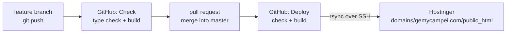

# Deployment

How the website gets from your computer to Hostinger. You set this up once; afterwards
every merge into `master` publishes the website automatically.



- [.github/workflows/check.yml](../.github/workflows/check.yml) tests every feature branch
  and pull request. Nothing is published.
- [.github/workflows/deploy.yml](../.github/workflows/deploy.yml) runs for every change on
  `master`: check, build, upload. If the check or the build fails, the live website stays
  as it was.

---

## Everyday work

```bash
git switch master && git pull          # start from the live version
git switch -c new-gallery-seceda       # a feature branch, any name
npm run manage                         # change things (or edit files), check with npm run dev
git add . && git commit -m "Add Seceda elopement"
git push -u origin new-gallery-seceda  # GitHub tests the branch (Actions tab › Check)
```

Then on GitHub: **Pull requests › New pull request** (`new-gallery-seceda` → `master`), wait
for the green tick, **Merge**. A few minutes later the change is live. The progress is in
the **Actions** tab; the first run takes longer because all photos are optimised once.

Small fixes can also go straight to `master` (`git push` on master publishes immediately).

---

## One-time setup

### 1. Hostinger: website and SSH

1. hPanel › **Websites** › **Add website** › choose `gemycampei.com` (empty website, no
   builder or WordPress). It shares the hosting plan with be-bella.at.
2. hPanel › **Advanced › SSH Access**: enable SSH and note **IP/host**, **port** (usually
   `65002`) and **username** (e.g. `u123456789`).
3. Create a key pair just for the automatic upload (no passphrase), on your computer:
   ```bash
   ssh-keygen -t ed25519 -f ~/.ssh/gemycampei_deploy -N "" -C "github-deploy-gemycampei"
   ```
   In hPanel › SSH Access › **SSH keys** › Add, paste the content of
   `~/.ssh/gemycampei_deploy.pub` (the file **with** `.pub`).
4. Optional, more secure: get the server's host key and keep the output for step 2.3:
   ```bash
   ssh-keyscan -p 65002 <IP from hPanel>
   ```

### 2. GitHub: repository and secrets

1. Create a **private** repository (github.com › New repository, no README, no .gitignore),
   e.g. `gemycampei-website`. Then in the project folder:
   ```bash
   git remote add origin https://github.com/<your-user>/gemycampei-website.git
   git push -u origin master
   ```
   The photos make the first push about 340 MB, so it takes a while.
2. Repository › **Settings › Secrets and variables › Actions › New repository secret**:

   | Secret | Value |
   |---|---|
   | `SSH_HOST` | IP/host from hPanel |
   | `SSH_PORT` | port from hPanel, usually `65002` |
   | `SSH_USER` | username from hPanel |
   | `SSH_PRIVATE_KEY` | the whole content of `~/.ssh/gemycampei_deploy` (the file **without** `.pub`, including the BEGIN/END lines) |
   | `SSH_KNOWN_HOSTS` | optional: the output of `ssh-keyscan` from step 1.4 |

3. Optional, recommended: Settings › **Branches** › Add rule for `master` › "Require status
   checks to pass before merging" › choose **check**. Then a broken branch cannot be merged.
4. **Actions** tab › "Deploy to Hostinger" › **Run workflow** (or push to `master`).

### 3. Contact form

1. hPanel › **Emails**: make sure the mailbox `info@gemycampei.com` exists at Hostinger.
2. Create `domains/gemycampei.com/contact-config.php` on the server, **next to**
   `public_html` (not inside it): hPanel › File Manager, copy the content of
   `server/contact-config.example.php` and replace `CHANGE-ME` with the mailbox password.
   This file is never in Git and never overwritten by the deployment.

### 4. Test before switching the domain

Open the site with Hostinger's temporary preview address (hPanel › Websites ›
gemycampei.com › **Preview website**). Click through the pages, open galleries, and send a
test message through the contact form.

---

## Moving the domain from Pixieset to Hostinger

The domain is registered at Hostinger, but its DNS records point to Pixieset. Switching
means changing those records. Expect up to a few hours (rarely 24 h) until everyone sees
the new site; during that time some visitors still see Pixieset, nobody sees an error.

1. **Before you change anything, write down the email records.** hPanel › Domains ›
   gemycampei.com › **DNS / Nameservers**: note every `MX` record and every `TXT` record
   containing `spf`, `dkim` or `dmarc`. These deliver your email and must stay exactly as
   they are. Only the records for the website change.
2. In the same DNS list, find the records that point to Pixieset, usually:
   - an `A` record for `@` with a Pixieset IP address, and/or
   - a `CNAME` record for `www` pointing to a `…pixieset.com` address.
3. Point them to Hostinger:
   - `A` record `@` → the IP address of your hosting plan (hPanel › Websites ›
     gemycampei.com › Dashboard, "IP address"), and
   - `CNAME` `www` → `gemycampei.com`.
   If hPanel offers "Point domain to this website" when adding the website, that does the
   same. Remove any `AAAA` record for `@` that still points to Pixieset.
4. hPanel › **Security › SSL**: install the free SSL certificate for gemycampei.com (it can
   only be issued once the domain points to Hostinger, so this can take an hour).
5. In **Pixieset** › Website › Settings › **Custom domain**: remove `gemycampei.com`. Keep
   using Pixieset for client galleries if you like; they stay reachable under your Pixieset
   address (…pixieset.com). Update links in your client gallery emails if they used
   gemycampei.com.
6. Test old addresses, e.g. `https://gemycampei.com/THEWEDDING/` and
   `https://gemycampei.com/DolomitesPackages/`. They must forward to the new pages (this
   keeps your Google rankings).
7. Keep the Pixieset website plan until the new site has been running for a few weeks, then
   cancel it. Follow the launch checklist in [SEO.md](SEO.md) (Search Console, sitemap).

---

## Privacy by design

- No cookies, no analytics, no external fonts, no embeds. No cookie banner is needed.
- Fonts and images are served from our own server.
- The contact form sends an email and stores nothing. Spam protection uses a hidden
  honeypot field and a minimum fill time instead of Google reCAPTCHA.
- If you ever add analytics, maps or embedded Instagram, update the privacy policy first
  and check whether a consent banner becomes necessary.

## Before going live

- [x] Imprint and privacy policy filled in (manager › Settings). Check the open points in
      [SEO.md](SEO.md), section A.
- [ ] Only publish photos of couples who agreed to it.
- [ ] Vimeo › each Super 8 video › Privacy › allow embedding on gemycampei.com.
