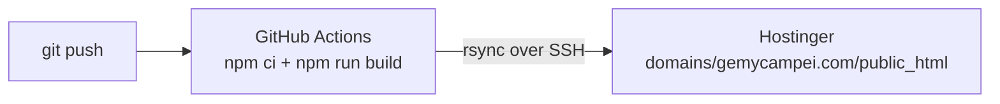

# Deployment

How the website gets from your computer to Hostinger. You set this up once; afterwards
every `git push` publishes automatically.



The workflow is defined in [.github/workflows/deploy.yml](../.github/workflows/deploy.yml).

---

## 1. Hostinger

1. hPanel › **Websites** › Add website › choose `gemycampei.com` (empty site, no builder).
2. hPanel › **Advanced › SSH Access**: enable SSH and note host, port (usually `65002`) and user.
3. On your computer, create a deploy key without a passphrase:
   ```bash
   ssh-keygen -t ed25519 -f ~/.ssh/gemycampei_deploy -N "" -C "github-deploy"
   ```
   Add the content of `~/.ssh/gemycampei_deploy.pub` in hPanel › SSH Access › SSH keys.
4. hPanel › **Emails**: create the mailbox `info@gemycampei.com`.
5. Copy `server/contact-config.example.php` to the server as
   `domains/gemycampei.com/contact-config.php` (**next to** `public_html`, not inside it)
   and fill in the mailbox password. Use hPanel's File Manager or:
   ```bash
   scp -P 65002 server/contact-config.example.php USER@HOST:domains/gemycampei.com/contact-config.php
   ```

## 2. GitHub

1. Create a **private** repository and push the project:
   ```bash
   git init
   git add .
   git commit -m "Initial website"
   git branch -M main
   git remote add origin https://github.com/<you>/gemycampei-website.git
   git push -u origin main
   ```
   The photos make the first push a few hundred MB, so it takes a while.
2. Repository › Settings › Secrets and variables › Actions › **New repository secret**:

   | Secret | Value |
   |---|---|
   | `SSH_HOST` | host from hPanel |
   | `SSH_PORT` | usually `65002` |
   | `SSH_USER` | e.g. `u523573211` |
   | `SSH_PRIVATE_KEY` | content of `~/.ssh/gemycampei_deploy` (the file **without** `.pub`) |

3. Actions tab › "Deploy to Hostinger" › **Run workflow**.

## 3. Test, then switch the domain

1. Open the site via Hostinger's temporary preview URL. Click through all pages, open a
   gallery, and send a test message through the contact form.
2. When everything works, point `gemycampei.com` from Pixieset to Hostinger (DNS in hPanel),
   remove the custom domain in Pixieset, and enable SSL in hPanel.
3. Test a few old addresses, e.g. `https://gemycampei.com/THEWEDDING/` and
   `https://gemycampei.com/LagoDiBraies/`. They should forward to the new pages.
4. Keep the Pixieset account until the new site has been running for a few weeks.

Then follow the launch checklist in [SEO.md](SEO.md).

---

## Privacy by design

- No cookies, no analytics, no external fonts, no embeds. No cookie banner is needed.
- Fonts and images are served from our own server.
- The contact form sends an email and stores nothing. Spam protection uses a hidden
  honeypot field and a minimum fill time instead of Google reCAPTCHA.
- If you ever add analytics, maps or embedded Instagram, update the privacy policy first
  and check whether a consent banner becomes necessary.

## Before going live

- [ ] Fill in **every** `TODO` in `src/site.config.ts` (legal name, address, trade licence).
- [ ] Review `src/pages/imprint.astro` and `src/pages/privacy.astro`, add the Hostinger
      contracting entity from your invoice, and have both checked (e.g. WKO template service).
      They are templates, not legal advice.
- [ ] Replace the placeholder testimonial photo and add the other reviews.
- [ ] Add the photos of the draft galleries, or leave them hidden.
- [ ] Only publish photos of couples who agreed to it.
